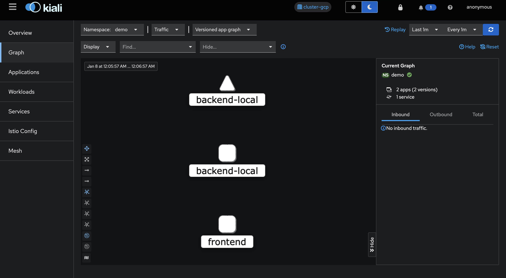
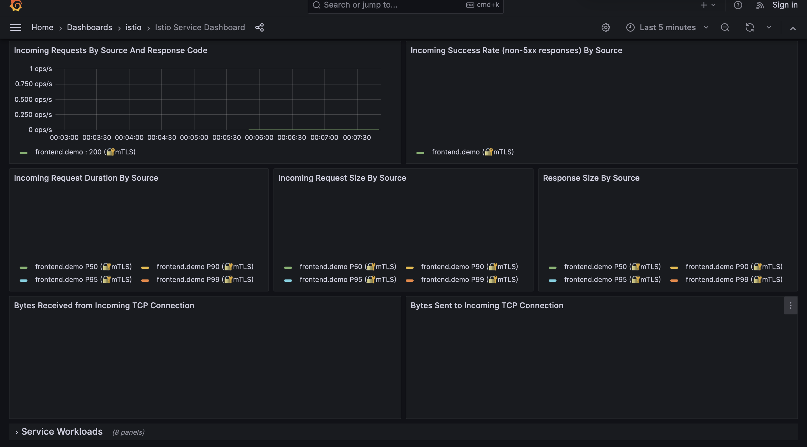

# Multi-Cluster Service Mesh with Istio
A hands-on project implementing Kubernetes service mesh across multiple clusters with zero-trust security model.
## What This Project Does
I built a multi-cluster Kubernetes setup using Istio service mesh to demonstrate how modern cloud-native applications handle security and observability. The setup simulates two different cloud providers (AWS and GCP) running on local Kind clusters.
Main features I implemented:
- Automatic mTLS encryption between all services
- Service mesh with sidecar proxies
- Full observability stack (monitoring, metrics, tracing)
- Zero-trust security policies
- Traffic management and routing
## Tech Stack
- Kubernetes - Container orchestration
- Istio v1.28 - Service mesh
- Kind - Local Kubernetes clusters
- Kiali - Service mesh visualization
- Prometheus - Metrics collection
- Grafana - Dashboards
- Jaeger - Distributed tracing
## Demo Results
### Kiali Service Graph
Real-time visualization of service dependencies and traffic flow:

### Grafana Metrics
Monitor service performance, request rates, and latency:

## Security Features
Enabled strict mTLS across the mesh - all service-to-service communication is encrypted automatically.
## What I Learned
Working on this project taught me alot about service mesh fundamentals, how sidecar proxies work, Kubernetes multi-cluster networking, and zero-trust security architecture.
## Future Improvements
- Deploy to real cloud providers (EKS + GKE)
- East-west gateway for true multi-cluster
- SPIFFE/SPIRE identity framework
- Chaos engineering tests
## License
MIT - feel free to use this for learning
Built this project to learn service mesh and improve my DevOps skills.
